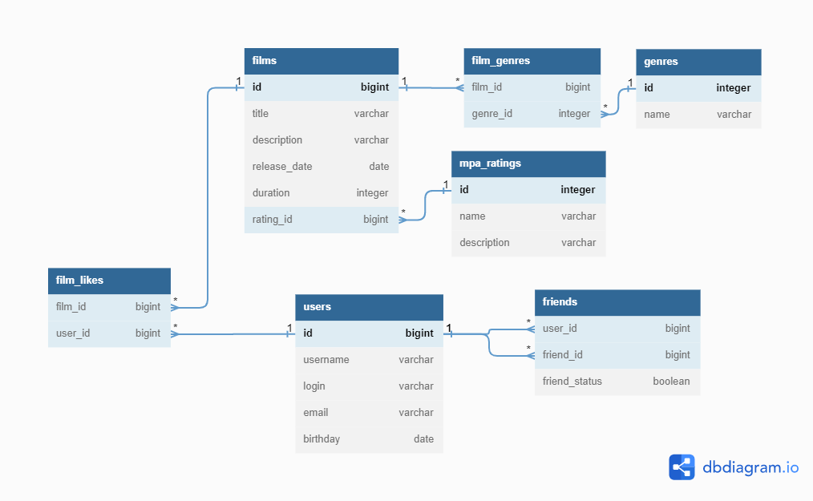

# java-filmorate

## Схема базы данных.



## Примеры SQL запросов.

<details>
<summary>Получаем топ 10 фильмов.</summary>

```SQL
SELECT *
FROM films
LEFT JOIN film_likes ON films.id = film_likes.film_id
GROUP BY films.id
ORDER BY COUNT(film_likes.user_id) DESC
LIMIT 10;
```

</details>

<details>
<summary>Получаем список друзей пользователя.</summary>

```SQL
SELECT *
FROM users
INNER JOIN friends ON users.id = friends.friend_id
WHERE friends.user_id = ?
 AND friend_status = TRUE;
```

</details>